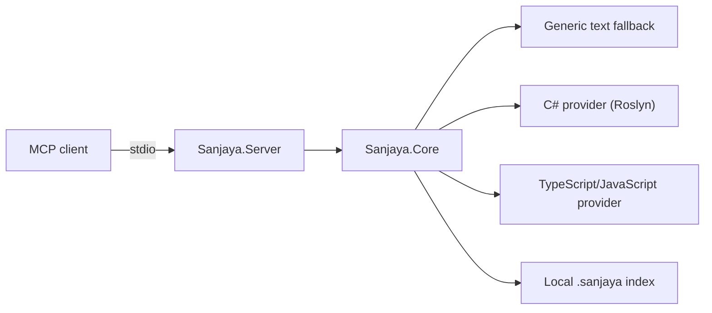

# Architecture

## Design goals

Sanjaya separates MCP transport, repository-safe core services, and
language-specific knowledge. The separation lets each provider report only the
capabilities it genuinely implements and makes those claims contract-testable.

## Project boundaries

### `Sanjaya.Server`

Owns MCP stdio hosting, tool registration, input/output schemas, cancellation,
and conversion between domain results and MCP content blocks. Standard output
is reserved for JSON-RPC. The protocol host starts without ambient application
configuration or default console logging providers.

### `Sanjaya.Core`

Owns public response contracts, capability descriptions, repository context,
canonical path containment, evidence models, file guards, deterministic index
contracts, and provider discovery.

The current server constructs one immutable repository scope from an explicit
`--root <path>` argument. Missing or invalid roots leave the protocol running
but make repository discovery unavailable. The ambient working directory is
never used as a fallback. Traversal canonicalizes existing path components,
rejects escapes and file symlinks, and never follows directory symlinks.

Core must not depend on Roslyn, the TypeScript compiler, or network services.

The local index builder consumes only `IStructuralChunkProvider` contracts. It
constructs a bounded canonical document before opening temporary output,
coordinates writers with an exclusive `.sanjaya/index.lock`, and atomically
promotes `.sanjaya/index-v1.json`. Provider and source fingerprints make
current, stale, and incompatible states explicit without machine-specific
metadata.

Local Git evidence uses a bounded process runner in Core. The runner starts the
`git` executable directly with an argument list, an immutable repository-root
working directory, sanitized Git environment, finite output buffers, timeout,
and cancellation-driven process-tree termination. A strict parser converts
NUL-delimited porcelain/log output into public contracts; raw stderr and
absolute roots never enter tool responses.

### `Sanjaya.Providers.CSharp`

Owns Roslyn-backed C# outlines, structural chunks, definitions, references, and
symbol-addressed source retrieval. v0.1 must describe syntax-based operations
honestly and must not imply full build or solution semantic resolution.

The current provider parses bounded source text with Roslyn syntax APIs only.
It implements `IFileOutlineProvider`, `IStructuralChunkProvider`,
`IReferenceProvider`, and `ISourceRetrievalProvider`; it does not open project
files, build a solution, start a subprocess, access the network, or write an
index.

### `Sanjaya.Providers.TypeScript`

Owns TypeScript compiler AST integration for TypeScript and JavaScript outlines
and chunks. The reviewed TypeScript 6.0.3 compiler API subset is vendored with
offline provenance and notice verification. Two single-language adapters share
one serialized persistent Node worker so capability and index labels remain
precise while compiler startup is paid once.

The npm launcher supplies its own absolute Node executable; the provider never
discovers an ambient executable or compiler. The worker receives only a strict
protocol envelope, repository-relative display path, language, and source text
already bounded by Core. It parses syntax only and never receives a repository
root, reads project files, imports source, loads configuration or plugins,
resolves modules, or type-checks.

Node starts directly without a shell, with a minimal environment, fixed
read-only access to the bundled worker and compiler, no filesystem-write,
child-process, worker-thread, addon, WASI, or inspector permission, a 256 MiB
V8 old-space limit, and five-second startup and request deadlines. The Node
Permission Model is defense in depth, not an operating-system sandbox. Node 22
and 24 do not enforce network permission; network absence on those supported
lines comes from the fixed trusted worker exposing no network operation and
never executing project source. Newer Node lines may add runtime enforcement.

## Extension model

Core exposes provider metadata through `ICapabilityProvider` and validated text
analysis through small operation contracts. `IFileOutlineProvider`,
`IStructuralChunkProvider`, `IReferenceProvider`, and
`ISourceRetrievalProvider` receive repository-relative paths and source text
only after Core has enforced containment, regular-file, UTF-8, and size rules.
Roslyn types never cross the provider boundary. Dynamic plugin loading and a
separately versioned provider SDK are deferred beyond v0.1.

## Distribution boundary

The root npm package contains a thin Node launcher and a framework-dependent
.NET 8 publish output. Before normal startup, the launcher verifies its Node
version, packaged server assembly, and installed .NET 8 runtime. It then
forwards stdio and process signals and passes its absolute Node executable to
the server for the bundled syntax worker. It does not implement discovery
behavior or download code during installation. The publish output is a portable DLL invocation rather than a
platform-specific app host; debug symbols and unused satellite resources are
excluded. The reviewed [packaging contract](packaging.md) defines the exact
payload and verification boundary.

The same launcher owns the non-MCP `--help`, `--version`, and `--diagnose`
boundary. Diagnostic mode completes before the server starts and writes only a
deterministic human-readable readiness report. It checks local runtimes,
packaged files, the configured root, and optional Git metadata without reading
project source or writing repository state. Normal startup keeps stdout
exclusively for MCP JSON-RPC.

## VS Code integration boundary

VS Code's native user-profile MCP configuration is sufficient for the v0.1
install-once experience; Sanjaya does not need an editor extension. The
reviewed configuration starts the exact npm version over stdio and passes
`${workspaceFolder}` as the explicit immutable root. Switching normal
single-folder projects therefore creates separate correctly scoped processes
without adding root-discovery behavior to the server.

The encoded installation URL is generated from the same canonical
configuration and is activation-locked while the package remains private or
development-versioned. Remote environments and multi-root workspaces require
explicit configurations because their repository location or root selection
cannot be inferred safely.

## Registry metadata boundary

The Official MCP Registry document describes identity and installation, not
the complete runtime capability contract. It points to one npm package over
stdio and models the existing CLI as a fixed `--root` argument followed by one
required repository-path input. It does not add a remote endpoint, secret,
environment override, shell command, runtime permission, or automatic root
discovery.

Capabilities remain authoritative at runtime through the `capabilities` tool
and in [capabilities.md](capabilities.md). License and third-party obligations
remain in the package files, and [privacy.md](privacy.md) remains authoritative
for local data behavior. Registry publication is a later release operation;
the current metadata and verifier retain the development publication locks.
