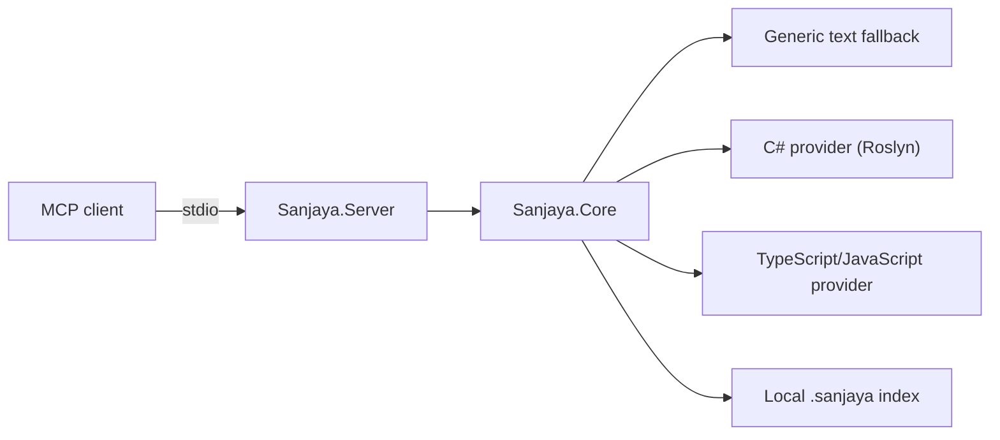

# Architecture

## Design goals

Sanjaya separates MCP transport, repository-safe core services, and
language-specific knowledge. The separation lets each provider report only the
capabilities it genuinely implements and makes those claims contract-testable.

## Project boundaries

### `Sanjaya.Server`

Owns MCP stdio hosting, tool registration, input/output schemas, cancellation,
and conversion between domain results and MCP content blocks. Standard output
is reserved for JSON-RPC. The protocol host starts without ambient application
configuration or default console logging providers.

### `Sanjaya.Core`

Owns public response contracts, capability descriptions, repository context,
canonical path containment, evidence models, file guards, deterministic index
contracts, and provider discovery.

The current server constructs one immutable repository scope from an explicit
`--root <path>` argument. Missing or invalid roots leave the protocol running
but make repository discovery unavailable. The ambient working directory is
never used as a fallback. Traversal canonicalizes existing path components,
rejects escapes and file symlinks, and never follows directory symlinks.

Core must not depend on Roslyn, the TypeScript compiler, or network services.

Local Git evidence uses a bounded process runner in Core. The runner starts the
`git` executable directly with an argument list, an immutable repository-root
working directory, sanitized Git environment, finite output buffers, timeout,
and cancellation-driven process-tree termination. A strict parser converts
NUL-delimited porcelain/log output into public contracts; raw stderr and
absolute roots never enter tool responses.

### `Sanjaya.Providers.CSharp`

Owns Roslyn-backed C# outlines, structural chunks, definitions, references, and
symbol-addressed source retrieval. v0.1 must describe syntax-based operations
honestly and must not imply full build or solution semantic resolution.

### `Sanjaya.Providers.TypeScript`

Owns TypeScript compiler AST integration for TypeScript and JavaScript outlines
and chunks. Compiler distribution is blocked until the provenance and notice
gate in `third_party/typescript/README.md` is satisfied.

## Extension model

Core exposes a small discovery contract through `ICapabilityProvider`.
Operation-specific provider interfaces will be added only with their first
implementation. Dynamic plugin loading and a separately versioned provider SDK
are deferred beyond v0.1.

## Distribution boundary

The root npm package contains a thin Node launcher and a framework-dependent
.NET 8 publish output. The launcher forwards stdio and process signals; it does
not implement product behavior or download code during installation.
